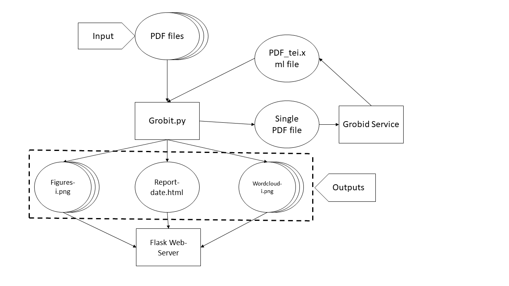

[](https://pdf-analyzer-software.readthedocs.io/en/latest/?badge=latest) [](https://zenodo.org/badge/latestdoi/609290837)

# IA_in_Software_Engineering

This is a personal repository for the subject Artificial Intelligence And Open Science In Research Software Engineering.

# Individual Assessment 1
## File structure
```bash
 Individual_Assessment_1
   ├── PDFs
   ├── Script
   ├── docs
   ├── flask
   ├── static
   ├── templates
   └── test
```
## Workflow



## Where to get help

If you have any issue with docker containers, you can find futher information in the following [link](https://docs.docker.com)

Otherwise, you can contact the main author of this repository by email: [Miguel Yanez](m.yanez@alumnos.upm.es)
